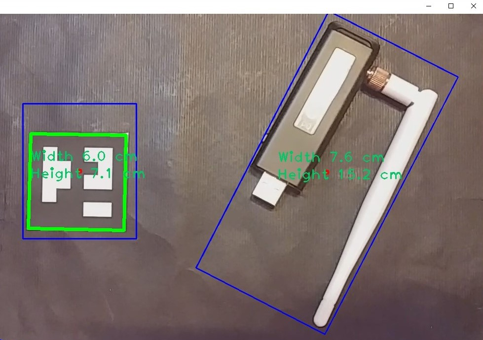

## Object Measurement Project Using ArUco Marker and OpenCV

### Contact

For any inquiries or permissions, please contact:

- **Name**: Jaydeep Solanki
- **Email**: jaydeep.solankee@yahoo.com
- **LinkedIn**: [Jaydeep Solanki on LinkedIn](https://www.linkedin.com/in/jaydeep-solanki-79ab61253/)

---

### Introduction

This repository contains a basic and simple Object Measurement project that works with ArUco markers using OpenCV. Instead of using a camera with a laser to measure the distance of objects, this project utilizes ArUco markers for measurement. The green line represents the ArUco marker, while the blue lines represent detected objects. The red dot indicates the center of the detected object's bounding box. From these, we can calculate the height and width of the detected object.

### Requirements

- **opencv-contrib-python package**: This project requires the `opencv-contrib-python` package. If you only install `opencv`, you may encounter errors. Install `opencv-contrib-python` to avoid this issue.

### ArUco Marker

- Print the `5x5_aruco.svg` file at 5x5 centimeter size. The provided code assumes this size. If you print it at a different size, you will need to adjust the code accordingly.

### Project Overview

1. The program first detects the ArUco marker and draws a green line around it.
2. It calculates the number of pixels that make up the green line.
3. It converts the pixel count to centimeters to measure objects in the camera frame.
4. The size of the ArUco marker used in this project is 5x5 centimeters. Thus, the program divides the pixel count by 20 to calculate the size in centimeters.

### How to Run the Project

1. Ensure you have the necessary dependencies installed:
   ```bash
   pip install opencv-contrib-python
   ```
2. Run the `main.py` file:
   ```bash
   python main.py
   ```

### Example

Below is a visual representation of how the program works:



- **Green Line**: ArUco marker
- **Blue Line**: Detected object
- **Red Dot**: Center of the detected object's bounding box

### Notes

- Ensure the ArUco marker is printed at 5x5 centimeters for accurate measurements.
- Adjust the code if you print the ArUco marker at a different size.
- The project uses OpenCV and threading to process the camera feed and detect objects simultaneously.


---

Feel free to contact Jaydeep Solanki for any questions or further information about the project.